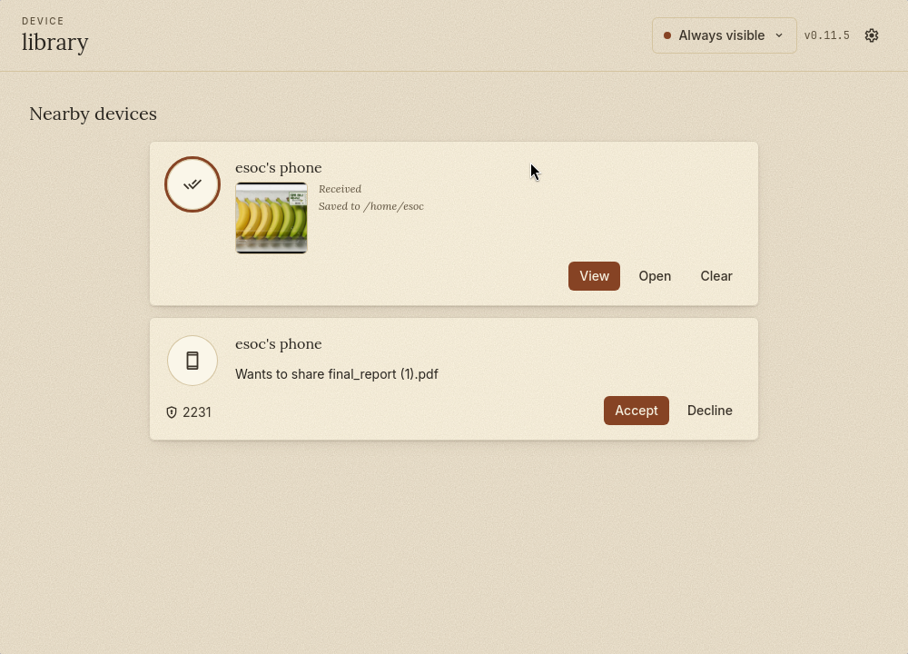

<div align="center">
  <h1>Ferry</h1>
  <p><strong>Quick Share / Nearby Share for Linux and macOS.</strong></p>
  <p>Send files between your phone and your computer over Wi-Fi, the same way Android phones do it to each other.</p>

  <p>
    <a href="https://github.com/Slush97/ferryshare/actions/workflows/build.yml"></a>
    <a href="https://github.com/Slush97/ferryshare/actions/workflows/lint.yml"></a>
  </p>
</div>



> **Fork notice.** Ferry is a maintained fork of [`Martichou/rquickshare`](https://github.com/Martichou/rquickshare) by Martin Andre, which is no longer actively developed. The original work is © 2024 Martin Andre and licensed under GPL-3.0; this fork preserves that license. Modifications by slush97, beginning 2026-05-05.

---

## What it does

Ferry talks the [Quick Share / Nearby Share](https://en.wikipedia.org/wiki/Quick_Share) protocol, so an Android phone (or any Quick Share-compatible device) can send files to your laptop, and your laptop can send files back. Both ends need to be on the same Wi-Fi network.

It is **not** a cloud sync service — there's no account, no server, nothing leaves your network.

## Status

Linux is the primary target and where Ferry sees daily use. macOS builds run in CI and are expected to work but get less testing. Windows is not supported.

## Install

Pre-built packages are published with each release: <https://github.com/Slush97/ferryshare/releases/latest>.

The minimum supported GLIBC version is included in each filename — check yours with `ldd --version`.

### Linux

Ferry needs one of `libayatana-appindicator` or `libappindicator3` for the system tray icon. The packages should pull this in automatically; install it manually if they don't.

| Format | Command |
|---|---|
| `.deb` (Debian / Ubuntu) | `sudo dpkg -i ferry_${VERSION}.deb` |
| `.rpm` (Fedora / RHEL) | `sudo dnf install ferry-${VERSION}.rpm` |
| `.AppImage` | `chmod +x ferry_${VERSION}.AppImage && ./ferry_${VERSION}.AppImage` |

### macOS

Open the `.dmg` and drag Ferry into Applications. The first launch may need approval at **System Settings → Privacy & Security → Security**.

## Build from source

See [BUILD.md](BUILD.md). Quick version:

```bash
# core library
cd core_lib && cargo build --release

# desktop app
cd app/main && pnpm install && pnpm dev    # dev
cd app/main && pnpm build                  # release bundles
```

## Limitations

- **Wi-Fi only.** Both devices must be on the same network.
- **mDNS-based discovery.** Public networks (cafés, airports) often block mDNS — discovery will fail.
- **Bluetooth advert (Linux).** Ferry broadcasts a small BLE advert to wake up Android's discovery. Bluetooth is optional but strongly recommended.

## FAQ

<details>
<summary><b>My laptop can't see my Android phone.</b></summary>

Android stops broadcasting its mDNS service most of the time, even with visibility set to "Everyone". Ferry pokes it back into action with a Bluetooth advert — make sure Bluetooth is on.

If you don't have Bluetooth, two workarounds:
1. Open the **Files** by Google app on your phone → "Nearby Share" tab. That forces mDNS to broadcast.
2. Use a shortcut maker (e.g. [Activity Launcher](https://xdaforums.com/t/how-to-manually-create-a-homescreen-shortcut-to-a-known-unique-android-activity.4336833)) to launch one of:
   - Activity: `com.google.android.gms.nearby.sharing.ReceiveSurfaceActivity`
   - Action: `com.google.android.gms.RECEIVE_NEARBY` with mime `*/*`

Samsung's "Quick Share" is a re-skinned, partially incompatible variant — these workarounds may not work on Samsung devices.
</details>

<details>
<summary><b>My phone keeps appearing and disappearing while I'm trying to send.</b></summary>

Expected. Android only advertises when it thinks someone is sending it something, then immediately backs off. The BLE advert keeps poking it. As long as you can complete a transfer, this is fine.
</details>

<details>
<summary><b>The window is blank / won't render (Linux + NVIDIA).</b></summary>

WebKitGTK's compositing path is broken on some NVIDIA + Wayland combos. Ferry sets `WEBKIT_DISABLE_COMPOSITING_MODE=1` and `WEBKIT_DISABLE_DMABUF_RENDERER=1` automatically at startup; if you still see issues, try launching with both env vars explicitly:

```bash
WEBKIT_DISABLE_COMPOSITING_MODE=1 WEBKIT_DISABLE_DMABUF_RENDERER=1 ferry
```
</details>

<details>
<summary><b>Closing the window doesn't quit the app.</b></summary>

By design — Ferry minimizes to the tray so it can keep receiving transfers. Toggle **"Stop app on close"** in settings (three-dot menu) if you'd rather have close mean quit.

To check whether it's still running: `ps aux | grep ferry`.
</details>

<details>
<summary><b>My firewall is blocking the connection.</b></summary>

By default Ferry uses a random port (assigned by the OS). Pin it to a fixed value by editing the settings file:

```bash
# Linux
$EDITOR ~/.local/share/io.github.slush97.ferry/.settings.json

# macOS
$EDITOR ~/Library/Application\ Support/io.github.slush97.ferry/.settings.json
```

Add `"port": 12345` (any free port). The JSON has to stay valid — watch trailing commas.
</details>

## Credits

Ferry stands on the shoulders of:

- [`Martichou/rquickshare`](https://github.com/Martichou/rquickshare) — Martin Andre's original implementation, which Ferry forks.
- [`grishka/NearDrop`](https://github.com/grishka/NearDrop) — reference implementation for macOS.
- [`vicr123/QNearbyShare`](https://github.com/vicr123/QNearbyShare) — Qt implementation that helped pin down the protocol.

## Contributing

Issues and pull requests welcome. For larger changes, open an issue first to discuss the approach.

## License

GPL-3.0-or-later. See [LICENSE](LICENSE). The original work is © 2024 Martin Andre; modifications © 2026 slush97.
